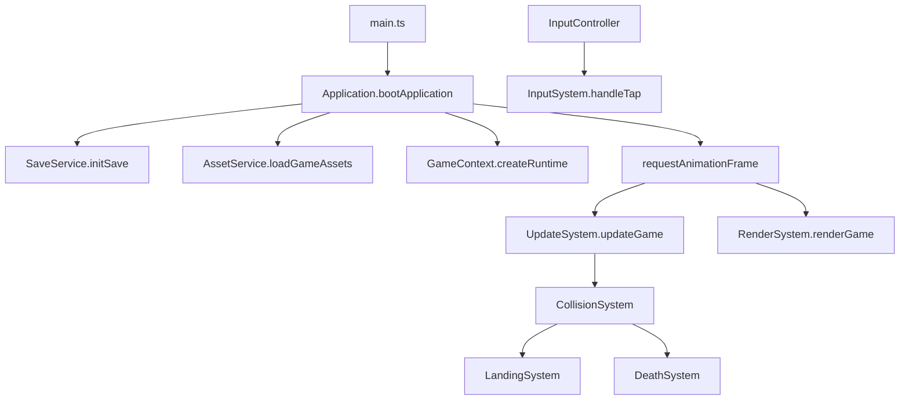

# Hopiku Architecture

Enterprise-style layout for the YouTube Playables bamboo stacker. Each layer has a single responsibility; game logic flows top-down from the app shell into systems.

## Directory layout

```
src/
├── app/              Application bootstrap, input wiring
├── config/           Tunable constants and asset manifests
├── core/             Shared types, runtime state, loop helpers
├── entities/         Player, platforms, particles
├── world/            Background, biomes, ambience, spawn planning
├── systems/          Frame update, render, collision, round flow
├── services/         Assets, audio, save, feedback
├── platform/youtube/ YouTube Playables SDK bridge
├── ui/               DOM screens and HUD
└── utils/            Viewport, haptics (cross-cutting helpers)
```

## Runtime flow



## Key types

- **`RuntimeState`** (`core/GameContext.ts`) — single source of truth for a play session.
- **`GamePhase`** — state machine: START → PLAYING → DYING_* → GAMEOVER.
- **Systems** are pure functions over `RuntimeState`; no hidden singletons.

## Path aliases

Imports use `@app`, `@config`, `@core`, `@entities`, `@world`, `@systems`, `@services`, `@platform`, `@ui`, `@utils` (configured in `tsconfig.json` and `vite.config.ts`).

## Adding features

| Change | Where |
|--------|--------|
| New biome | `world/Biomes.ts` |
| Spawn difficulty | `world/spawn/` |
| Scoring rules | `systems/LandingSystem.ts`, `config/game.constants.ts` |
| New screen | `ui/dom.ts` + `index.html` |
| Platform integration | `platform/youtube/` |

## Scripts

- `npm run dev` — local dev server
- `npm run build` — typecheck + production bundle
- `npm run build:playable` — YouTube Playables package
- `npm test` — Vitest unit tests
- `npm run lint` — ESLint
